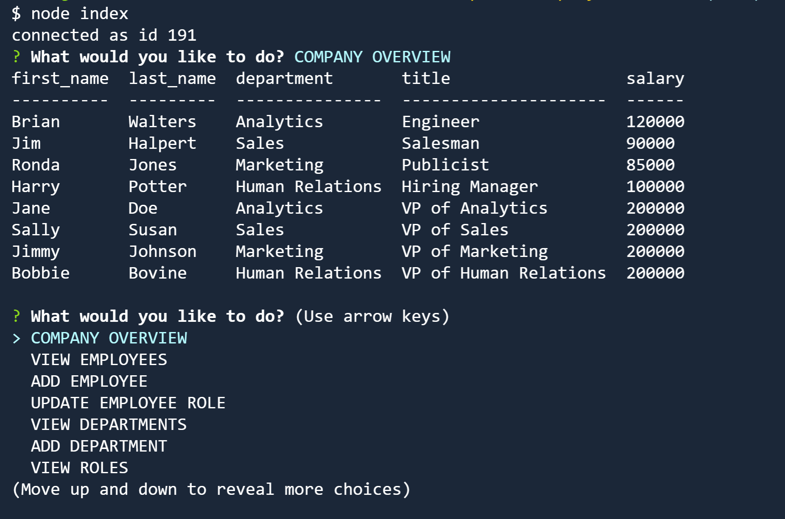

# employee-tracker

## Description

My motivation for creating this application, was to get more familiar with back end development and using SQL joins. This application would be helpful for any company looking to keep track of employees or company data. During this project, I learned a lot about SQL joins, and how to use Inquirer and MySql to create a console line application.

## Table of Contents

- [Installation](#installation)
- [Usage](#usage)
- [License](#license)

## Installation

Here is the link to the Github repository where the repo can be cloned (https://github.com/bwalters8910/employee-tracker).

## Usage

Link to video walkthrough. (https://drive.google.com/file/d/1L3G__MCI79WGxPB8nTBwKRrIvjFOpmiy/view)

## License

[MIT](https://choosealicense.com/licenses/mit/)
